# FastGateway 系统流程图和时序图

## 目录
- [1. 系统架构图](#1-系统架构图)
- [2. 连接建立流程图](#2-连接建立流程图)
- [3. 请求处理时序图](#3-请求处理时序图)
- [4. 隧道创建流程图](#4-隧道创建流程图)
- [5. 数据流转图](#5-数据流转图)
- [6. 心跳保活时序图](#6-心跳保活时序图)
- [7. 错误处理流程图](#7-错误处理流程图)

## 1. 系统架构图

## 2. 连接建立流程图

## 3. 请求处理时序图

```mermaid
sequenceDiagram
    participant Client as 外部客户端
    participant Gateway as FastGateway
    participant Router as 路由器
    participant TunnelMgr as 隧道管理器
    participant Agent as AgentClient
    participant TClient as TunnelClient
    participant LocalSvc as 内网服务

    Client->>Gateway: HTTPS请求
    Gateway->>Router: 路由解析
    Router->>Router: 匹配域名和路径
    Router->>TunnelMgr: 查找对应TunnelClient
    
    TunnelMgr->>TunnelMgr: 生成tunnelId
    Note over TunnelMgr: UUID.NewGuid()
    
    TunnelMgr->>Agent: 发送tunnelId
    Agent->>TClient: 通过主连接通知
    Note over Agent,TClient: "tunnelId\r\n"
    
    TClient->>TClient: 创建到服务器的隧道连接
    TClient->>LocalSvc: 连接本地服务端口
    LocalSvc-->>TClient: 连接建立成功
    
    TClient->>Agent: 隧道连接建立完成
    Agent->>Gateway: 隧道就绪
    
    Note over Client,LocalSvc: 开始双向数据传输
    Client->>Gateway: 请求数据
    Gateway->>Agent: 转发请求
    Agent->>TClient: 通过隧道传输
    TClient->>LocalSvc: 转发到本地服务
    
    LocalSvc-->>TClient: 响应数据
    TClient-->>Agent: 通过隧道返回
    Agent-->>Gateway: 返回响应
    Gateway-->>Client: 最终响应
```

## 4. 隧道创建流程图

## 5. 数据流转图

## 6. 心跳保活时序图

## 7. 错误处理流程图

## 8. 完整系统交互图

## 9. 性能监控图

## 10. 部署架构图

这些Mermaid图表详细展示了FastGateway系统的各个方面，包括架构设计、数据流转、时序交互、错误处理等核心流程，为理解系统提供了直观的可视化参考。