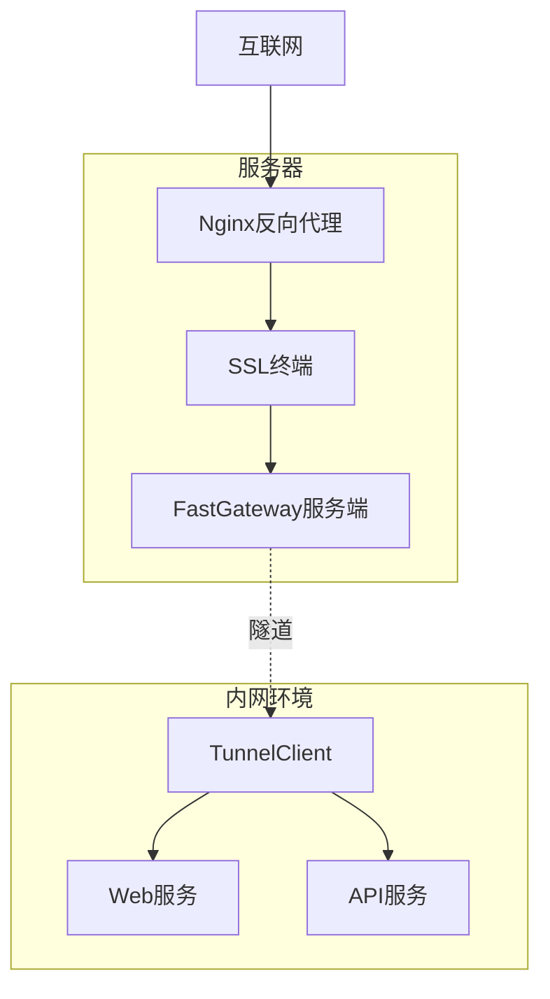
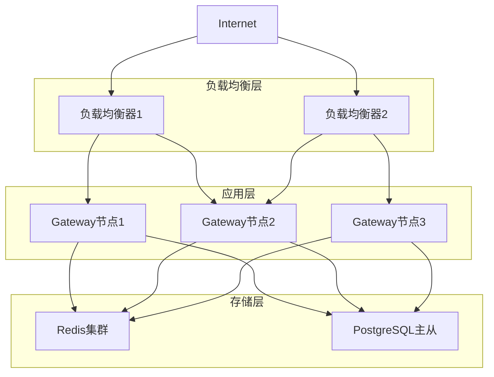

# FastGateway 配置文件和部署指南

## 目录
- [1. 系统配置概述](#1-系统配置概述)
- [2. 服务端配置详解](#2-服务端配置详解)
- [3. 客户端配置详解](#3-客户端配置详解)
- [4. 部署架构方案](#4-部署架构方案)
- [5. Docker容器化部署](#5-docker容器化部署)
- [6. 系统服务配置](#6-系统服务配置)
- [7. 监控和日志配置](#7-监控和日志配置)
- [8. 安全配置最佳实践](#8-安全配置最佳实践)

## 1. 系统配置概述

FastGateway 采用分离式架构，包含服务端和客户端两个核心组件，每个组件都有独立的配置文件和部署要求。

### 1.1 配置文件结构

```
FastGateway/
├── src/FastGateway/           # 服务端
│   ├── appsettings.json       # 主配置文件
│   ├── appsettings.Development.json
│   ├── appsettings.Production.json
│   ├── config.json            # 业务配置文件
│   └── gateway.pfx            # 默认SSL证书
├── src/TunnelClient/          # 客户端
│   ├── tunnel.json            # 隧道配置文件
│   └── appsettings.json       # 客户端配置
└── docs/                      # 文档目录
    ├── examples/              # 配置示例
    └── deployment/            # 部署脚本
```

### 1.2 配置管理原则

1. **配置分离**: 业务配置与系统配置分离
2. **环境隔离**: 开发、测试、生产环境配置隔离
3. **安全第一**: 敏感信息加密存储
4. **热重载**: 支持配置文件热重载
5. **版本控制**: 配置变更可追溯

## 2. 服务端配置详解

### 2.1 主配置文件 (appsettings.json)

```json
{
  "Logging": {
    "LogLevel": {
      "Default": "Information",
      "Microsoft.AspNetCore": "Warning",
      "Microsoft.AspNetCore.Hosting": "Information",
      "FastGateway": "Debug"
    }
  },
  "AllowedHosts": "*",
  
  // JWT认证配置
  "JwtOptions": {
    "Secret": "your-super-secret-jwt-key-here-must-be-at-least-32-characters",
    "ExpireDay": 30,
    "Issuer": "FastGateway",
    "Audience": "FastGateway-Client"
  },
  
  // 隧道认证Token
  "TunnelToken": "your-tunnel-token-here",
  
  // 数据库连接字符串（可选）
  "ConnectionStrings": {
    "DefaultConnection": "Data Source=gateway.db"
  },
  
  // Kestrel服务器配置
  "Kestrel": {
    "Limits": {
      "MaxConcurrentConnections": 1000,
      "MaxConcurrentUpgradedConnections": 1000,
      "MaxRequestBodySize": null,
      "KeepAliveTimeout": "00:02:00",
      "RequestHeadersTimeout": "00:00:30"
    }
  },
  
  // SSL配置
  "Https": {
    "DefaultCertificate": {
      "Path": "gateway.pfx",
      "Password": "010426"
    }
  },
  
  // 性能配置
  "Performance": {
    "EnableResponseCompression": true,
    "EnableResponseCaching": false,
    "MaxConcurrentTunnels": 500
  }
}
```

### 2.2 业务配置文件 (config.json)

```json
{
  "servers": [
    {
      "id": "main-server",
      "name": "主服务器",
      "listen": 80,
      "isHttps": true,
      "enable": true,
      "copyRequestHost": false,
      "staticCompress": true,
      "enableBlacklist": false,
      "enableWhitelist": false,
      "description": "主要的HTTP/HTTPS服务器"
    },
    {
      "id": "api-server",
      "name": "API服务器",
      "listen": 8080,
      "isHttps": false,
      "enable": true,
      "copyRequestHost": true,
      "staticCompress": false,
      "enableBlacklist": true,
      "enableWhitelist": false,
      "description": "专用API服务器"
    }
  ],
  
  "domainNames": [
    {
      "id": "web-domain",
      "serverId": "main-server",
      "domains": ["example.com", "www.example.com"],
      "path": "/",
      "service": "http://node_client1/",
      "serviceType": "Service",
      "enable": true,
      "host": null,
      "description": "主网站域名"
    },
    {
      "id": "api-domain",
      "serverId": "main-server",
      "domains": ["api.example.com"],
      "path": "/api",
      "service": "http://node_client1/api",
      "serviceType": "Service",
      "enable": true,
      "host": "internal-api.local",
      "description": "API接口域名"
    },
    {
      "id": "static-files",
      "serverId": "main-server",
      "domains": ["static.example.com"],
      "path": "/",
      "serviceType": "StaticFile",
      "root": "/var/www/static",
      "tryFiles": ["index.html", "index.htm"],
      "enable": true,
      "description": "静态文件服务"
    }
  ],
  
  "certificates": [
    {
      "id": "main-cert",
      "domain": "example.com",
      "file": "/etc/ssl/certs/example.com.crt",
      "key": "/etc/ssl/private/example.com.key",
      "password": "",
      "isActive": true,
      "autoRenew": true,
      "expiryDate": "2024-12-31T23:59:59Z",
      "description": "主域名SSL证书"
    }
  ],
  
  "accessControls": [
    {
      "id": "api-whitelist",
      "type": "Whitelist",
      "ipRanges": [
        "192.168.1.0/24",
        "10.0.0.0/8",
        "172.16.0.0/12"
      ],
      "enable": true,
      "description": "API访问白名单"
    },
    {
      "id": "attack-blacklist",
      "type": "Blacklist", 
      "ipRanges": [
        "1.2.3.4/32",
        "5.6.7.0/24"
      ],
      "enable": true,
      "description": "攻击IP黑名单"
    }
  ],
  
  "rateLimits": [
    {
      "id": "global-limit",
      "name": "全局限流",
      "maxRequests": 1000,
      "windowSizeSeconds": 60,
      "type": "SlidingWindow",
      "scope": "Global",
      "pathPattern": "*",
      "ipPattern": "*",
      "enable": true,
      "description": "全局请求限流规则"
    },
    {
      "id": "api-limit",
      "name": "API限流",
      "maxRequests": 100,
      "windowSizeSeconds": 60,
      "type": "SlidingWindow",
      "scope": "PerIp",
      "pathPattern": "/api/*",
      "ipPattern": "*",
      "enable": true,
      "description": "API接口限流规则"
    }
  ],
  
  "settings": {
    "autoBackup": true,
    "backupInterval": 24,
    "maxBackupFiles": 7,
    "enableMetrics": true,
    "metricsInterval": 60
  }
}
```

### 2.3 生产环境配置 (appsettings.Production.json)

```json
{
  "Logging": {
    "LogLevel": {
      "Default": "Warning",
      "FastGateway": "Information",
      "Microsoft": "Warning"
    },
    "Console": {
      "IncludeScopes": false
    },
    "File": {
      "Path": "/var/log/fastgateway/app.log",
      "MaxFileSize": "10MB",
      "MaxFiles": 5
    }
  },
  
  "Kestrel": {
    "Limits": {
      "MaxConcurrentConnections": 5000,
      "MaxConcurrentUpgradedConnections": 2000,
      "MaxRequestBodySize": 104857600,
      "KeepAliveTimeout": "00:05:00"
    },
    "EndPoints": {
      "Http": {
        "Url": "http://*:80"
      },
      "Https": {
        "Url": "https://*:443"
      }
    }
  },
  
  "Performance": {
    "EnableResponseCompression": true,
    "EnableResponseCaching": true,
    "MaxConcurrentTunnels": 2000,
    "TunnelTimeoutSeconds": 300,
    "HeartbeatIntervalSeconds": 30
  }
}
```

## 3. 客户端配置详解

### 3.1 隧道配置文件 (tunnel.json)

```json
{
  "port": 8080,
  "token": "your-tunnel-token-here",
  "type": "h2",
  "serverHttp2Support": true,
  "serverUrl": "https://gateway.example.com",
  "name": "client1",
  "reconnectInterval": 5000,
  "heartbeatInterval": 30000,
  
  "proxy": [
    {
      "host": null,
      "domains": ["web.example.com"],
      "route": "/",
      "localRemote": "http://localhost:3000",
      "description": "Web应用代理",
      "enabled": true
    },
    {
      "host": "api.internal",
      "domains": ["api.example.com"],
      "route": "/api",
      "localRemote": "http://localhost:8000",
      "description": "API服务代理",
      "enabled": true
    },
    {
      "host": null,
      "domains": ["admin.example.com"],
      "route": "/admin",
      "localRemote": "http://localhost:9000",
      "description": "管理后台代理",
      "enabled": false
    },
    {
      "host": null,
      "domains": ["files.example.com"],
      "route": "/",
      "localRemote": "http://localhost:8888",
      "description": "文件服务代理",
      "enabled": true
    }
  ]
}
```

### 3.2 客户端应用配置 (appsettings.json)

```json
{
  "Logging": {
    "LogLevel": {
      "Default": "Information",
      "TunnelClient": "Debug",
      "Microsoft": "Warning"
    }
  },
  
  "ConnectionSettings": {
    "ConnectTimeout": 60000,
    "ReadTimeout": 30000,
    "WriteTimeout": 30000,
    "MaxRetryAttempts": 3,
    "RetryDelay": 5000
  },
  
  "Performance": {
    "MaxConcurrentTunnels": 100,
    "BufferSize": 8192,
    "EnableCompression": false
  },
  
  "Monitoring": {
    "EnableMetrics": true,
    "MetricsInterval": 60,
    "LogConnectionEvents": true
  }
}
```

### 3.3 WebSocket模式配置

```json
{
  "port": 8080,
  "token": "your-tunnel-token-here",
  "type": "ws",
  "serverHttp2Support": false,
  "serverUrl": "wss://gateway.example.com",
  "name": "ws-client1",
  "reconnectInterval": 3000,
  "heartbeatInterval": 20000,
  
  "webSocketOptions": {
    "keepAliveInterval": 30,
    "receiveBufferSize": 4096,
    "sendBufferSize": 4096,
    "subProtocol": "tunneling-proto"
  },
  
  "proxy": [
    {
      "domains": ["ws-app.example.com"],
      "route": "/",
      "localRemote": "ws://localhost:3001",
      "description": "WebSocket应用代理",
      "enabled": true
    }
  ]
}
```

## 4. 部署架构方案

### 4.1 单机部署架构



**部署脚本 (deploy-single.sh):**

```bash
#!/bin/bash

# FastGateway单机部署脚本
set -e

echo "开始部署FastGateway..."

# 检查系统要求
check_requirements() {
    echo "检查系统要求..."
    
    # 检查.NET 8运行时
    if ! command -v dotnet &> /dev/null; then
        echo "安装.NET 8运行时..."
        wget https://packages.microsoft.com/config/ubuntu/20.04/packages-microsoft-prod.deb -O packages-microsoft-prod.deb
        sudo dpkg -i packages-microsoft-prod.deb
        sudo apt-get update
        sudo apt-get install -y aspnetcore-runtime-8.0
    fi
    
    # 检查防火墙配置
    echo "配置防火墙..."
    sudo ufw allow 80/tcp
    sudo ufw allow 443/tcp
    sudo ufw allow 8080/tcp
}

# 创建目录结构
setup_directories() {
    echo "创建目录结构..."
    sudo mkdir -p /opt/fastgateway
    sudo mkdir -p /var/log/fastgateway
    sudo mkdir -p /etc/fastgateway
    sudo mkdir -p /var/lib/fastgateway
    
    # 设置权限
    sudo chown -R $USER:$USER /opt/fastgateway
    sudo chown -R $USER:$USER /var/log/fastgateway
    sudo chmod 755 /opt/fastgateway
    sudo chmod 755 /var/log/fastgateway
}

# 部署服务端
deploy_server() {
    echo "部署FastGateway服务端..."
    
    # 复制文件
    cp -r ./src/FastGateway/bin/Release/net8.0/publish/* /opt/fastgateway/
    
    # 复制配置文件
    cp ./docs/examples/appsettings.Production.json /opt/fastgateway/appsettings.json
    cp ./docs/examples/config.json /etc/fastgateway/
    
    # 生成默认SSL证书
    openssl req -x509 -newkey rsa:4096 -keyout /etc/fastgateway/gateway.key \
                -out /etc/fastgateway/gateway.crt -days 365 -nodes \
                -subj "/C=CN/ST=State/L=City/O=Organization/CN=localhost"
    
    # 转换为PFX格式
    openssl pkcs12 -export -out /etc/fastgateway/gateway.pfx \
                   -inkey /etc/fastgateway/gateway.key \
                   -in /etc/fastgateway/gateway.crt \
                   -password pass:010426
    
    # 复制证书到应用目录
    cp /etc/fastgateway/gateway.pfx /opt/fastgateway/
}

# 创建系统服务
create_service() {
    echo "创建系统服务..."
    
    sudo tee /etc/systemd/system/fastgateway.service > /dev/null <<EOF
[Unit]
Description=FastGateway Service
Documentation=https://github.com/example/fastgateway
After=network.target

[Service]
Type=notify
ExecStart=/usr/bin/dotnet /opt/fastgateway/FastGateway.dll
Restart=on-failure
RestartSec=5
TimeoutStopSec=90
KillMode=mixed
User=$USER
Group=$USER

# 环境变量
Environment=ASPNETCORE_ENVIRONMENT=Production
Environment=ASPNETCORE_URLS=http://+:80;https://+:443
Environment=DOTNET_PRINT_TELEMETRY_MESSAGE=false

# 工作目录
WorkingDirectory=/opt/fastgateway

# 日志配置
StandardOutput=journal
StandardError=journal
SyslogIdentifier=fastgateway

[Install]
WantedBy=multi-user.target
EOF

    # 重新加载systemd配置
    sudo systemctl daemon-reload
    sudo systemctl enable fastgateway
}

# 配置Nginx反向代理
setup_nginx() {
    echo "配置Nginx反向代理..."
    
    sudo tee /etc/nginx/sites-available/fastgateway > /dev/null <<EOF
server {
    listen 80;
    server_name _;
    
    # ACME Challenge支持
    location /.well-known/acme-challenge/ {
        proxy_pass http://127.0.0.1:8080;
        proxy_set_header Host \$host;
        proxy_set_header X-Real-IP \$remote_addr;
        proxy_set_header X-Forwarded-For \$proxy_add_x_forwarded_for;
        proxy_set_header X-Forwarded-Proto \$scheme;
    }
    
    # 重定向到HTTPS
    location / {
        return 301 https://\$server_name\$request_uri;
    }
}

server {
    listen 443 ssl http2;
    server_name _;
    
    # SSL配置
    ssl_certificate /etc/fastgateway/gateway.crt;
    ssl_certificate_key /etc/fastgateway/gateway.key;
    ssl_protocols TLSv1.2 TLSv1.3;
    ssl_ciphers ECDHE-RSA-AES128-GCM-SHA256:ECDHE-RSA-AES256-GCM-SHA384;
    
    # 反向代理到FastGateway
    location / {
        proxy_pass http://127.0.0.1:8080;
        proxy_set_header Host \$host;
        proxy_set_header X-Real-IP \$remote_addr;
        proxy_set_header X-Forwarded-For \$proxy_add_x_forwarded_for;
        proxy_set_header X-Forwarded-Proto \$scheme;
        
        # WebSocket支持
        proxy_http_version 1.1;
        proxy_set_header Upgrade \$http_upgrade;
        proxy_set_header Connection "upgrade";
        
        # 超时配置
        proxy_connect_timeout 60s;
        proxy_send_timeout 60s;
        proxy_read_timeout 60s;
    }
}
EOF

    # 启用站点
    sudo ln -sf /etc/nginx/sites-available/fastgateway /etc/nginx/sites-enabled/
    sudo nginx -t && sudo systemctl reload nginx
}

# 主部署流程
main() {
    check_requirements
    setup_directories
    deploy_server
    create_service
    setup_nginx
    
    echo "启动FastGateway服务..."
    sudo systemctl start fastgateway
    sudo systemctl status fastgateway
    
    echo "部署完成！"
    echo "服务状态: sudo systemctl status fastgateway"
    echo "查看日志: sudo journalctl -u fastgateway -f"
    echo "配置文件: /etc/fastgateway/config.json"
}

main "$@"
```

### 4.2 高可用集群部署



**集群部署配置 (docker-compose.cluster.yml):**

```yaml
version: '3.8'

services:
  # HAProxy负载均衡器
  haproxy:
    image: haproxy:2.8
    ports:
      - "80:80"
      - "443:443"
      - "8404:8404"  # 监控页面
    volumes:
      - ./haproxy.cfg:/usr/local/etc/haproxy/haproxy.cfg:ro
      - ./ssl:/etc/ssl/certs:ro
    depends_on:
      - gateway1
      - gateway2
    networks:
      - gateway-network
    restart: unless-stopped

  # Gateway节点1
  gateway1:
    build: 
      context: .
      dockerfile: src/FastGateway/Dockerfile
    environment:
      - ASPNETCORE_ENVIRONMENT=Production
      - ASPNETCORE_URLS=http://+:8080
      - TunnelToken=${TUNNEL_TOKEN}
      - Redis__ConnectionString=redis:6379
    volumes:
      - ./config:/app/config:ro
      - ./logs:/app/logs
    networks:
      - gateway-network
    depends_on:
      - redis
    restart: unless-stopped

  # Gateway节点2
  gateway2:
    build: 
      context: .
      dockerfile: src/FastGateway/Dockerfile
    environment:
      - ASPNETCORE_ENVIRONMENT=Production
      - ASPNETCORE_URLS=http://+:8080
      - TunnelToken=${TUNNEL_TOKEN}
      - Redis__ConnectionString=redis:6379
    volumes:
      - ./config:/app/config:ro
      - ./logs:/app/logs
    networks:
      - gateway-network
    depends_on:
      - redis
    restart: unless-stopped

  # Redis缓存
  redis:
    image: redis:7-alpine
    command: redis-server --appendonly yes
    volumes:
      - redis-data:/data
    networks:
      - gateway-network
    restart: unless-stopped

  # PostgreSQL数据库
  postgres:
    image: postgres:15
    environment:
      - POSTGRES_DB=fastgateway
      - POSTGRES_USER=gateway
      - POSTGRES_PASSWORD=${DB_PASSWORD}
    volumes:
      - postgres-data:/var/lib/postgresql/data
      - ./init.sql:/docker-entrypoint-initdb.d/init.sql:ro
    networks:
      - gateway-network
    restart: unless-stopped

  # 监控服务
  prometheus:
    image: prom/prometheus:latest
    ports:
      - "9090:9090"
    volumes:
      - ./prometheus.yml:/etc/prometheus/prometheus.yml:ro
    networks:
      - gateway-network
    restart: unless-stopped

  grafana:
    image: grafana/grafana:latest
    ports:
      - "3000:3000"
    environment:
      - GF_SECURITY_ADMIN_PASSWORD=${GRAFANA_PASSWORD}
    volumes:
      - grafana-data:/var/lib/grafana
    networks:
      - gateway-network
    restart: unless-stopped

volumes:
  redis-data:
  postgres-data:
  grafana-data:

networks:
  gateway-network:
    driver: bridge
```

## 5. Docker容器化部署

### 5.1 服务端Dockerfile

```dockerfile
# src/FastGateway/Dockerfile
FROM mcr.microsoft.com/dotnet/aspnet:8.0-nightly-preview AS base
WORKDIR /app
EXPOSE 80
EXPOSE 443

# 安装系统依赖
RUN apt-get update && apt-get install -y \
    curl \
    ca-certificates \
    && rm -rf /var/lib/apt/lists/*

FROM mcr.microsoft.com/dotnet/sdk:8.0-nightly-preview AS build
WORKDIR /src

# 复制项目文件
COPY ["src/FastGateway/FastGateway.csproj", "src/FastGateway/"]
COPY ["src/Core/Core.csproj", "src/Core/"]

# 还原NuGet包
RUN dotnet restore "src/FastGateway/FastGateway.csproj"

# 复制源码并构建
COPY . .
WORKDIR "/src/src/FastGateway"
RUN dotnet build "FastGateway.csproj" -c Release -o /app/build

FROM build AS publish
RUN dotnet publish "FastGateway.csproj" -c Release -o /app/publish /p:UseAppHost=false

FROM base AS final
WORKDIR /app

# 创建非root用户
RUN groupadd -r gateway && useradd -r -g gateway gateway

# 创建必要目录
RUN mkdir -p /app/logs /app/config && \
    chown -R gateway:gateway /app

# 复制发布文件
COPY --from=publish /app/publish .

# 复制配置文件
COPY --chown=gateway:gateway src/FastGateway/appsettings.json .
COPY --chown=gateway:gateway src/FastGateway/gateway.pfx .

# 切换到非root用户
USER gateway

# 健康检查
HEALTHCHECK --interval=30s --timeout=10s --start-period=5s --retries=3 \
    CMD curl -f http://localhost/health || exit 1

ENTRYPOINT ["dotnet", "FastGateway.dll"]
```

### 5.2 客户端Dockerfile

```dockerfile
# src/TunnelClient/Dockerfile
FROM mcr.microsoft.com/dotnet/aspnet:8.0-nightly-preview AS base
WORKDIR /app
EXPOSE 8080

FROM mcr.microsoft.com/dotnet/sdk:8.0-nightly-preview AS build
WORKDIR /src

# 复制项目文件
COPY ["src/TunnelClient/TunnelClient.csproj", "src/TunnelClient/"]
COPY ["src/Core/Core.csproj", "src/Core/"]

# 还原NuGet包
RUN dotnet restore "src/TunnelClient/TunnelClient.csproj"

# 复制源码并构建
COPY . .
WORKDIR "/src/src/TunnelClient"
RUN dotnet build "TunnelClient.csproj" -c Release -o /app/build

FROM build AS publish
RUN dotnet publish "TunnelClient.csproj" -c Release -o /app/publish /p:UseAppHost=false

FROM base AS final
WORKDIR /app

# 创建非root用户
RUN groupadd -r tunnel && useradd -r -g tunnel tunnel

# 创建配置目录
RUN mkdir -p /app/config && chown -R tunnel:tunnel /app

# 复制发布文件
COPY --from=publish /app/publish .

# 切换到非root用户
USER tunnel

# 健康检查
HEALTHCHECK --interval=30s --timeout=10s --start-period=5s --retries=3 \
    CMD curl -f http://localhost:8080/health || exit 1

ENTRYPOINT ["dotnet", "TunnelClient.dll", "-c", "/app/config/tunnel.json"]
```

### 5.3 Docker Compose配置

```yaml
# docker-compose.yml
version: '3.8'

services:
  # FastGateway服务端
  fastgateway:
    build:
      context: .
      dockerfile: src/FastGateway/Dockerfile
    ports:
      - "80:80"
      - "443:443"
    environment:
      - ASPNETCORE_ENVIRONMENT=Production
      - ASPNETCORE_URLS=http://+:80;https://+:443
      - TunnelToken=${TUNNEL_TOKEN:-default-token}
    volumes:
      - ./config/gateway:/app/config:ro
      - ./logs/gateway:/app/logs
      - ./ssl:/app/ssl:ro
    networks:
      - fastgateway-network
    restart: unless-stopped
    healthcheck:
      test: ["CMD", "curl", "-f", "http://localhost/health"]
      interval: 30s
      timeout: 10s
      retries: 3
      start_period: 40s

  # TunnelClient示例
  tunnel-client:
    build:
      context: .
      dockerfile: src/TunnelClient/Dockerfile
    environment:
      - DOTNET_ENVIRONMENT=Production
    volumes:
      - ./config/client/tunnel.json:/app/config/tunnel.json:ro
      - ./logs/client:/app/logs
    networks:
      - fastgateway-network
    depends_on:
      fastgateway:
        condition: service_healthy
    restart: unless-stopped

  # Nginx反向代理（可选）
  nginx:
    image: nginx:alpine
    ports:
      - "8080:80"
    volumes:
      - ./nginx.conf:/etc/nginx/nginx.conf:ro
      - ./ssl:/etc/nginx/ssl:ro
    depends_on:
      - fastgateway
    networks:
      - fastgateway-network
    restart: unless-stopped

networks:
  fastgateway-network:
    driver: bridge
    ipam:
      config:
        - subnet: 172.20.0.0/16

volumes:
  gateway-logs:
  client-logs:
```

### 5.4 部署脚本

```bash
#!/bin/bash
# deploy-docker.sh

set -e

echo "FastGateway Docker部署脚本"

# 检查Docker和Docker Compose
check_docker() {
    if ! command -v docker &> /dev/null; then
        echo "Docker未安装，正在安装..."
        curl -fsSL https://get.docker.com -o get-docker.sh
        sh get-docker.sh
        sudo usermod -aG docker $USER
    fi
    
    if ! command -v docker-compose &> /dev/null; then
        echo "Docker Compose未安装，正在安装..."
        sudo curl -L "https://github.com/docker/compose/releases/download/v2.20.0/docker-compose-$(uname -s)-$(uname -m)" \
             -o /usr/local/bin/docker-compose
        sudo chmod +x /usr/local/bin/docker-compose
    fi
}

# 准备配置文件
prepare_configs() {
    echo "准备配置文件..."
    
    # 创建目录结构
    mkdir -p config/gateway config/client logs/gateway logs/client ssl
    
    # 生成随机Token
    if [ ! -f .env ]; then
        echo "TUNNEL_TOKEN=$(openssl rand -hex 32)" > .env
        echo "DB_PASSWORD=$(openssl rand -hex 16)" >> .env
        echo "GRAFANA_PASSWORD=admin123" >> .env
    fi
    
    # 复制配置文件模板
    cp docs/examples/config.json config/gateway/
    cp docs/examples/tunnel.json config/client/
    
    # 生成SSL证书
    if [ ! -f ssl/gateway.crt ]; then
        openssl req -x509 -newkey rsa:2048 -keyout ssl/gateway.key \
                    -out ssl/gateway.crt -days 365 -nodes \
                    -subj "/C=CN/ST=State/L=City/O=FastGateway/CN=localhost"
    fi
}

# 构建镜像
build_images() {
    echo "构建Docker镜像..."
    docker-compose build --no-cache
}

# 启动服务
start_services() {
    echo "启动服务..."
    docker-compose up -d
    
    # 等待服务启动
    echo "等待服务启动..."
    sleep 10
    
    # 检查服务状态
    docker-compose ps
}

# 主函数
main() {
    check_docker
    prepare_configs
    build_images
    start_services
    
    echo "部署完成！"
    echo "FastGateway: http://localhost"
    echo "管理界面: http://localhost:3000 (admin/admin123)"
    echo "监控页面: http://localhost:9090"
    echo ""
    echo "查看日志: docker-compose logs -f"
    echo "停止服务: docker-compose down"
}

main "$@"
```

## 6. 系统服务配置

### 6.1 Windows服务配置

```powershell
# install-windows-service.ps1

# 检查管理员权限
if (-NOT ([Security.Principal.WindowsPrincipal] [Security.Principal.WindowsIdentity]::GetCurrent()).IsInRole([Security.Principal.WindowsBuiltInRole] "Administrator"))
{
    Write-Host "请以管理员身份运行此脚本" -ForegroundColor Red
    exit 1
}

# 配置参数
$serviceName = "FastGateway"
$serviceDisplayName = "FastGateway Service"
$serviceDescription = "FastGateway内网穿透服务"
$servicePath = "C:\FastGateway"
$executablePath = "$servicePath\FastGateway.exe"

# 创建服务目录
if (!(Test-Path $servicePath)) {
    New-Item -ItemType Directory -Path $servicePath -Force
    Write-Host "创建服务目录: $servicePath"
}

# 复制文件
Write-Host "复制服务文件..."
Copy-Item -Path ".\src\FastGateway\bin\Release\net8.0\publish\*" -Destination $servicePath -Recurse -Force

# 创建配置目录
$configPath = "$servicePath\config"
if (!(Test-Path $configPath)) {
    New-Item -ItemType Directory -Path $configPath -Force
}

# 复制配置文件
Copy-Item -Path ".\docs\examples\appsettings.Production.json" -Destination "$servicePath\appsettings.json" -Force
Copy-Item -Path ".\docs\examples\config.json" -Destination "$configPath\config.json" -Force

# 停止并删除现有服务
if (Get-Service $serviceName -ErrorAction SilentlyContinue) {
    Write-Host "停止现有服务..."
    Stop-Service $serviceName -Force
    sc.exe delete $serviceName
    Start-Sleep -Seconds 2
}

# 创建新服务
Write-Host "创建Windows服务..."
sc.exe create $serviceName binPath= $executablePath DisplayName= $serviceDisplayName start= auto
sc.exe description $serviceName $serviceDescription

# 配置服务恢复选项
sc.exe failure $serviceName reset= 86400 actions= restart/5000/restart/5000/restart/5000

# 启动服务
Write-Host "启动服务..."
Start-Service $serviceName

# 检查服务状态
$service = Get-Service $serviceName
Write-Host "服务状态: $($service.Status)"

if ($service.Status -eq "Running") {
    Write-Host "FastGateway服务安装并启动成功！" -ForegroundColor Green
    Write-Host "服务名称: $serviceName"
    Write-Host "服务路径: $servicePath"
    Write-Host "配置文件: $configPath\config.json"
} else {
    Write-Host "服务启动失败，请检查日志" -ForegroundColor Red
}
```

### 6.2 Linux Systemd服务

```bash
#!/bin/bash
# install-linux-service.sh

set -e

# 检查root权限
if [ "$EUID" -ne 0 ]; then
    echo "请使用sudo运行此脚本"
    exit 1
fi

# 配置变量
SERVICE_NAME="fastgateway"
SERVICE_USER="gateway"
INSTALL_DIR="/opt/fastgateway"
CONFIG_DIR="/etc/fastgateway"
LOG_DIR="/var/log/fastgateway"
DATA_DIR="/var/lib/fastgateway"

echo "安装FastGateway Linux服务..."

# 创建服务用户
if ! id "$SERVICE_USER" &>/dev/null; then
    echo "创建服务用户: $SERVICE_USER"
    useradd --system --home-dir $INSTALL_DIR --shell /bin/false $SERVICE_USER
fi

# 创建目录
echo "创建目录结构..."
mkdir -p $INSTALL_DIR $CONFIG_DIR $LOG_DIR $DATA_DIR

# 复制文件
echo "复制服务文件..."
cp -r ./src/FastGateway/bin/Release/net8.0/publish/* $INSTALL_DIR/

# 复制配置文件
cp ./docs/examples/appsettings.Production.json $INSTALL_DIR/appsettings.json
cp ./docs/examples/config.json $CONFIG_DIR/

# 设置权限
chown -R $SERVICE_USER:$SERVICE_USER $INSTALL_DIR $LOG_DIR $DATA_DIR
chown -R root:$SERVICE_USER $CONFIG_DIR
chmod -R 750 $CONFIG_DIR
chmod +x $INSTALL_DIR/FastGateway

# 创建systemd服务文件
echo "创建systemd服务..."
cat > /etc/systemd/system/$SERVICE_NAME.service << EOF
[Unit]
Description=FastGateway Service
Documentation=https://github.com/example/fastgateway
After=network.target
Wants=network.target

[Service]
Type=notify
ExecStart=/usr/bin/dotnet $INSTALL_DIR/FastGateway.dll
ExecReload=/bin/kill -HUP \$MAINPID
Restart=on-failure
RestartSec=5
TimeoutStopSec=90
KillMode=mixed

# 用户和组
User=$SERVICE_USER
Group=$SERVICE_USER

# 环境变量
Environment=ASPNETCORE_ENVIRONMENT=Production
Environment=ASPNETCORE_URLS=http://+:80;https://+:443
Environment=DOTNET_PRINT_TELEMETRY_MESSAGE=false

# 工作目录
WorkingDirectory=$INSTALL_DIR

# 安全设置
NoNewPrivileges=yes
PrivateTmp=yes
ProtectSystem=strict
ProtectHome=yes
ReadWritePaths=$LOG_DIR $DATA_DIR $CONFIG_DIR

# 网络权限
CapabilityBoundingSet=CAP_NET_BIND_SERVICE
AmbientCapabilities=CAP_NET_BIND_SERVICE

# 日志配置
StandardOutput=journal
StandardError=journal
SyslogIdentifier=$SERVICE_NAME

[Install]
WantedBy=multi-user.target
EOF

# 创建日志轮转配置
cat > /etc/logrotate.d/$SERVICE_NAME << EOF
$LOG_DIR/*.log {
    daily
    missingok
    rotate 7
    compress
    delaycompress
    notifempty
    create 644 $SERVICE_USER $SERVICE_USER
    postrotate
        systemctl reload $SERVICE_NAME > /dev/null 2>&1 || true
    endscript
}
EOF

# 重新加载systemd并启动服务
echo "启动服务..."
systemctl daemon-reload
systemctl enable $SERVICE_NAME
systemctl start $SERVICE_NAME

# 检查服务状态
sleep 2
if systemctl is-active --quiet $SERVICE_NAME; then
    echo "FastGateway服务安装并启动成功！"
    echo "服务状态: $(systemctl is-active $SERVICE_NAME)"
    echo "查看状态: systemctl status $SERVICE_NAME"
    echo "查看日志: journalctl -u $SERVICE_NAME -f"
    echo "配置文件: $CONFIG_DIR/config.json"
else
    echo "服务启动失败，查看日志:"
    journalctl -u $SERVICE_NAME --no-pager
    exit 1
fi
```

## 7. 监控和日志配置

### 7.1 Prometheus监控配置

```yaml
# prometheus.yml
global:
  scrape_interval: 15s
  evaluation_interval: 15s

rule_files:
  - "fastgateway_rules.yml"

scrape_configs:
  - job_name: 'fastgateway'
    static_configs:
      - targets: ['fastgateway:8080']
    metrics_path: '/metrics'
    scrape_interval: 10s
    scrape_timeout: 5s

  - job_name: 'tunnel-clients'
    static_configs:
      - targets: ['tunnel-client:8080']
    metrics_path: '/metrics'
    scrape_interval: 30s

alerting:
  alertmanagers:
    - static_configs:
        - targets:
          - alertmanager:9093
```

**监控规则 (fastgateway_rules.yml):**

```yaml
groups:
  - name: fastgateway_alerts
    rules:
      - alert: FastGatewayDown
        expr: up{job="fastgateway"} == 0
        for: 1m
        labels:
          severity: critical
        annotations:
          summary: "FastGateway service is down"
          description: "FastGateway has been down for more than 1 minute"

      - alert: HighTunnelCount
        expr: fastgateway_active_tunnels > 1000
        for: 5m
        labels:
          severity: warning
        annotations:
          summary: "High number of active tunnels"
          description: "Active tunnel count is {{ $value }}"

      - alert: HighErrorRate
        expr: rate(fastgateway_errors_total[5m]) > 0.1
        for: 2m
        labels:
          severity: warning
        annotations:
          summary: "High error rate detected"
          description: "Error rate is {{ $value }} errors per second"

      - alert: MemoryUsageHigh
        expr: process_resident_memory_bytes{job="fastgateway"} > 1e9
        for: 5m
        labels:
          severity: warning
        annotations:
          summary: "High memory usage"
          description: "Memory usage is {{ $value | humanize }}B"
```

### 7.2 日志配置

```json
{
  "Serilog": {
    "Using": ["Serilog.Sinks.Console", "Serilog.Sinks.File", "Serilog.Sinks.Elasticsearch"],
    "MinimumLevel": {
      "Default": "Information",
      "Override": {
        "Microsoft": "Warning",
        "Microsoft.AspNetCore": "Warning",
        "FastGateway": "Debug"
      }
    },
    "WriteTo": [
      {
        "Name": "Console",
        "Args": {
          "outputTemplate": "[{Timestamp:HH:mm:ss} {Level:u3}] {SourceContext}: {Message:lj}{NewLine}{Exception}"
        }
      },
      {
        "Name": "File",
        "Args": {
          "path": "/var/log/fastgateway/app-.log",
          "rollingInterval": "Day",
          "retainedFileCountLimit": 7,
          "outputTemplate": "[{Timestamp:yyyy-MM-dd HH:mm:ss.fff zzz} {Level:u3}] {SourceContext}: {Message:lj}{NewLine}{Exception}",
          "fileSizeLimitBytes": 104857600
        }
      },
      {
        "Name": "Elasticsearch",
        "Args": {
          "nodeUris": ["http://elasticsearch:9200"],
          "indexFormat": "fastgateway-logs-{0:yyyy.MM.dd}",
          "autoRegisterTemplate": true
        }
      }
    ],
    "Enrich": ["FromLogContext", "WithThreadId", "WithProcessId"],
    "Properties": {
      "Application": "FastGateway",
      "Environment": "Production"
    }
  }
}
```

## 8. 安全配置最佳实践

### 8.1 SSL/TLS配置

```nginx
# nginx-ssl.conf
server {
    listen 443 ssl http2;
    server_name gateway.example.com;

    # SSL证书配置
    ssl_certificate /etc/ssl/certs/gateway.example.com.crt;
    ssl_certificate_key /etc/ssl/private/gateway.example.com.key;

    # SSL安全配置
    ssl_protocols TLSv1.2 TLSv1.3;
    ssl_ciphers ECDHE-ECDSA-AES128-GCM-SHA256:ECDHE-RSA-AES128-GCM-SHA256:ECDHE-ECDSA-AES256-GCM-SHA384:ECDHE-RSA-AES256-GCM-SHA384;
    ssl_prefer_server_ciphers off;
    ssl_session_cache shared:SSL:10m;
    ssl_session_timeout 10m;

    # HSTS
    add_header Strict-Transport-Security "max-age=31536000; includeSubDomains" always;

    # 其他安全头
    add_header X-Frame-Options DENY always;
    add_header X-Content-Type-Options nosniff always;
    add_header X-XSS-Protection "1; mode=block" always;
    add_header Referrer-Policy "strict-origin-when-cross-origin" always;

    # OCSP Stapling
    ssl_stapling on;
    ssl_stapling_verify on;
    ssl_trusted_certificate /etc/ssl/certs/ca-certificates.crt;

    location / {
        proxy_pass http://127.0.0.1:8080;
        proxy_set_header Host $host;
        proxy_set_header X-Real-IP $remote_addr;
        proxy_set_header X-Forwarded-For $proxy_add_x_forwarded_for;
        proxy_set_header X-Forwarded-Proto $scheme;
        
        # 安全头
        proxy_set_header X-Forwarded-Host $host;
        proxy_set_header X-Forwarded-Server $host;
    }
}
```

### 8.2 防火墙配置

```bash
#!/bin/bash
# setup-firewall.sh

# 基本防火墙规则
ufw --force reset
ufw default deny incoming
ufw default allow outgoing

# 允许SSH
ufw allow 22/tcp

# 允许HTTP/HTTPS
ufw allow 80/tcp
ufw allow 443/tcp

# 允许隧道端口（限制源IP）
ufw allow from 192.168.0.0/16 to any port 8080
ufw allow from 10.0.0.0/8 to any port 8080

# 限制连接频率
ufw limit ssh

# 启用防火墙
ufw --force enable

# 显示状态
ufw status verbose
```

### 8.3 安全配置检查清单

```markdown
## 安全配置检查清单

### 网络安全
- [ ] 启用防火墙，只开放必要端口
- [ ] 配置SSL/TLS，使用强加密算法
- [ ] 设置HSTS和安全响应头
- [ ] 限制源IP访问敏感端点
- [ ] 配置DDoS防护

### 应用安全
- [ ] 使用强随机Token
- [ ] 启用JWT认证
- [ ] 配置访问控制列表
- [ ] 设置请求频率限制
- [ ] 启用日志记录和监控

### 系统安全
- [ ] 使用非root用户运行服务
- [ ] 设置文件权限和目录访问控制
- [ ] 启用系统日志
- [ ] 配置自动更新
- [ ] 定期备份配置和数据

### 运维安全
- [ ] 定期更新证书
- [ ] 监控异常访问
- [ ] 配置告警通知
- [ ] 定期安全审计
- [ ] 备份和恢复测试
```

这个详细的配置和部署指南涵盖了FastGateway系统的完整部署流程，包括单机部署、集群部署、容器化部署以及安全配置等各个方面，为系统的生产环境部署提供了全面的指导。